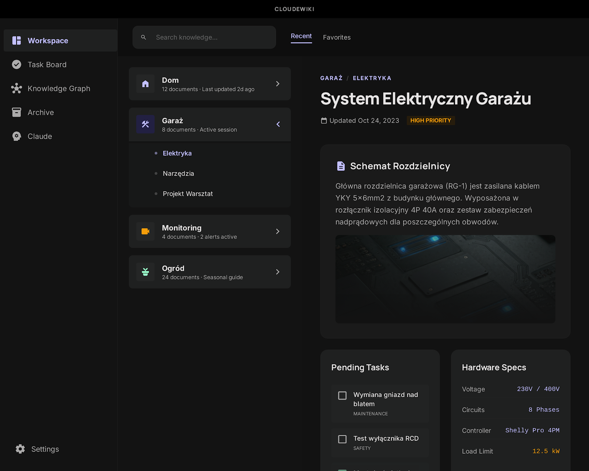
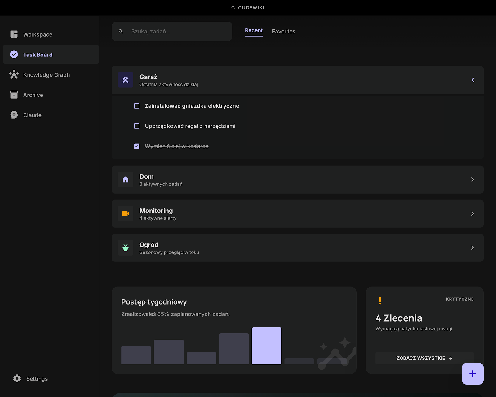
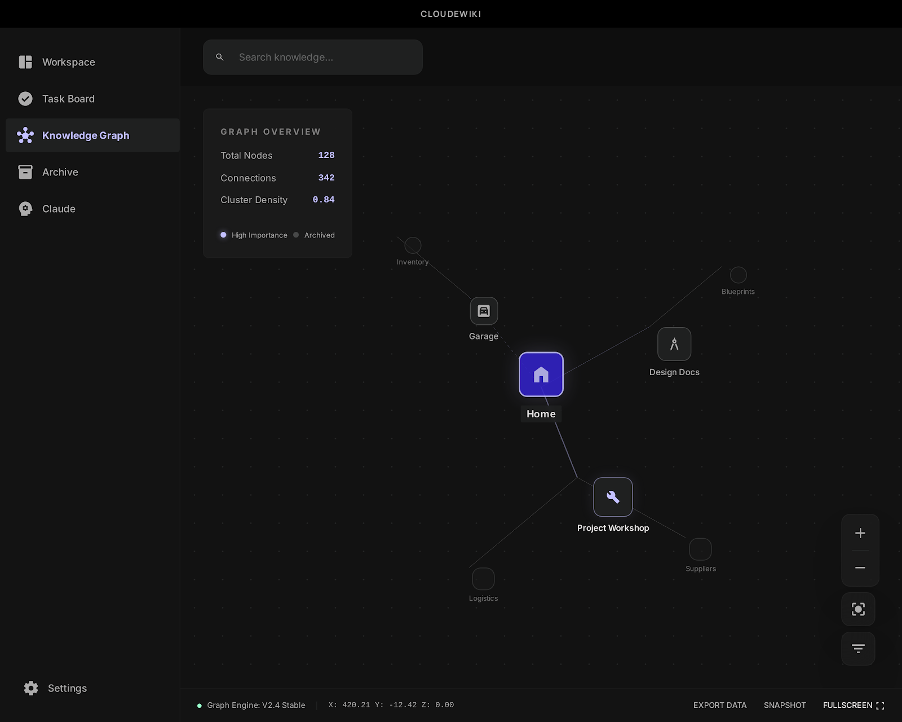

# ClaudeWiki

A desktop application for browsing and managing a personal knowledge base stored as Markdown files. Built with Electron, React, and TypeScript.



## Features

- **Workspace browser** — navigate your knowledge base as a tree of Markdown documents with frontmatter metadata (tags, connections, priorities)
- **Knowledge Graph** — interactive D3.js force-directed graph showing nodes and their connections
- **Task Board** — track TODOs across all documents with status management (pending / in progress / done)
- **Embedded Claude terminal** — built-in terminal (via node-pty + xterm.js) that launches Claude CLI directly in your knowledge base directory
- **Live reload** — file watcher (Chokidar) picks up external edits instantly, so changes made by Claude or any editor appear in real time
- **Themes** — system, light, and dark modes
- **i18n** — English and Polish language support
- **Auto-scaffolding** — first launch creates the required folder structure (`_meta/`, `_templates/`, `knowledge/`) in your chosen knowledge base directory

| Task Board | Knowledge Graph |
|---|---|
|  |  |

## Tech Stack

- **Electron** + **electron-vite** — desktop shell and build tooling
- **React 18** + **TypeScript** — renderer UI
- **D3-force** — graph visualization
- **gray-matter** — Markdown frontmatter parsing
- **Chokidar** — filesystem watching
- **electron-store** — settings persistence
- **node-pty** + **xterm.js** — embedded terminal

## Getting Started

### Prerequisites

- Node.js >= 18
- npm

### Install & Run

```bash
cd app
npm install
npm run dev
```

On first launch the app will ask you to select a knowledge base folder. The required scaffold files are created automatically if missing.

### Build

```bash
cd app
npm run build
```

## Releasing

Releases are built automatically on GitHub Actions (macOS arm64) and published as GitHub Releases with a DMG attached.

### Create a release

From the repo root:

```bash
./scripts/release.sh           # patch bump: 0.1.0 → 0.1.1
./scripts/release.sh minor     # minor bump: 0.1.0 → 0.2.0
./scripts/release.sh major     # major bump: 0.1.0 → 1.0.0
```

The script:
1. Bumps the version in `app/package.json`
2. Commits and creates a git tag (`v0.1.1`)
3. Pushes the commit and tag to GitHub
4. GitHub Actions picks up the tag, builds the DMG, and publishes the release

The build takes ~15 minutes. Monitor progress at **Actions** tab on GitHub.

### Notes

- Without signing secrets the release is published as a **pre-release** with an unsigned DMG. On first launch macOS Gatekeeper will warn — right-click `ClaudeWiki.app` → **Open** to bypass.
- To enable code signing and notarization, add the following secrets to the repo (requires Apple Developer Program membership):
  - `DEVELOPER_ID_CERT_P12_BASE64` — base64-encoded Developer ID Application certificate (.p12)
  - `DEVELOPER_ID_CERT_PASSWORD` — password for the .p12
  - `DEVELOPER_ID_APPLICATION` — full identity string, e.g. `Developer ID Application: Jan Kowalski (ABCD123456)`
  - `APPLE_ID`, `APPLE_TEAM_ID`, `APPLE_APP_PASSWORD` — for notarization
- The workflow uses `macos-14` (Apple Silicon arm64) runner. On Intel Macs the app runs via Rosetta 2.
- CI build scripts live in `scripts/release/` — separate steps for build, sign, notarize, DMG.

## Knowledge Base Structure

The knowledge base is a regular folder with Markdown files. ClaudeWiki expects:

```
your-knowledge-base/
  CLAUDE.md              # Instructions for Claude (auto-created)
  _meta/
    graph.json           # Node connections for the graph view
    todos.json           # Aggregated TODO items
  _templates/
    node.md              # Template for new knowledge nodes
  knowledge/
    index.md             # Root document
    ...                  # Your Markdown files (nested folders OK)
```

Each Markdown file uses YAML frontmatter:

```yaml
---
id: unique-id
title: Document Title
path: knowledge/category/document
tags: [tag1, tag2]
connections: [knowledge/other-document]
created: "2025-01-15"
updated: "2025-01-20"
---
```

## License

[MIT](LICENSE)
